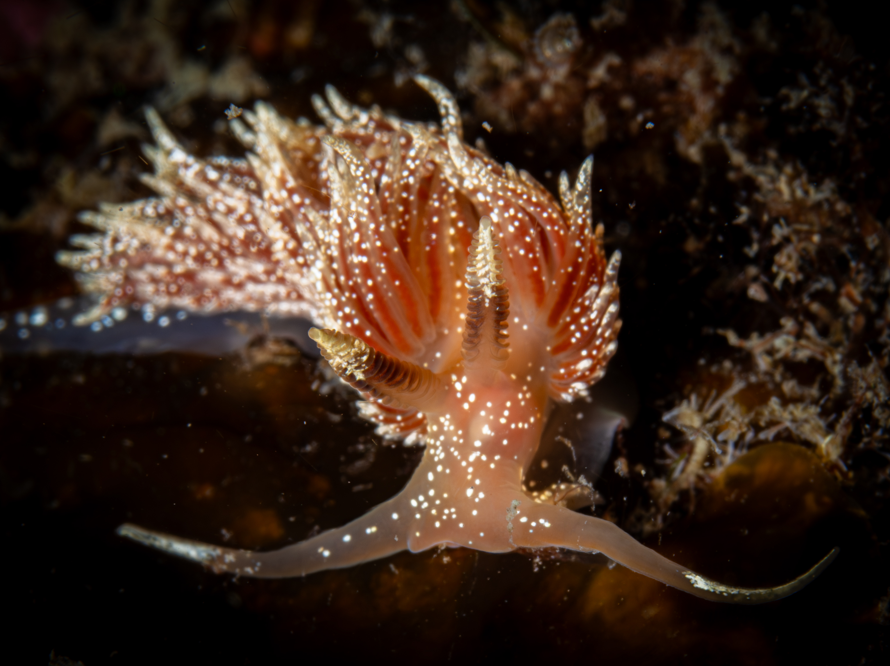

# My Photo Competition Entries - May 2026

This document contains the finalized submission details, photography metadata, and optimized descriptions for the upcoming photography competitions.

---

## Entry 1: "Marine Drama at Lough Hyne"

* **Target Competition:** "My Favourite Waterbody" Photo Competition 2026 (LAWPRO)
* **Submission Link:** [LAWPRO Submission Portal](https://consult.watersandcommunities.ie/en/content/my-favourite-waterbody-photo-competition-2026)
* **Submission Deadline:** 5:00 PM, Friday 22nd May 2026
* **Location:** Lough Hyne, County Cork (Europe's first Marine Nature Reserve)
* **Subject:** Ribbon worm (*Lineus longissimus*) preying upon a fan worm.
* **File Link:** [P4045593-3.jpg](./P4045593-3.jpg)
* **Requirements:** JPEG, PNG, or TIF (Max 15 MB)

### Image Preview

### Submission Caption (English)
Lough Hyne, Europe’s first Marine Nature Reserve, is a uniquely spectacular sanctuary for marine biodiversity. Every dive offers a window into a complex, hidden world. This photograph captures a rare, fascinating ecological interaction beneath the surface: a predatory ribbon worm (*Lineus longissimus*) preying upon a fan worm and skillfully extracting it from its protective tube. It is a striking reminder of how vibrant and worthy of protection our marine ecosystems truly are.
*(439 characters / 500 max)*

### Submission Caption (Russian)
Лох-Хайн, первый в Европе морской заповедник, — это уникальный островок морского биоразнообразия. Каждое погружение здесь открывает окно в сложный, скрытый мир. На этом снимке запечатлено редкое и захватывающее экологическое взаимодействие под водой: хищный немертин (*Lineus longissimus*) нападает на многощетинкового червя, искусно извлекая его из защитной трубки. Это яркое напоминание о том, насколько удивительны и ценны наши морские экосистемы.
*(446 characters / 500 max)*

---

## Entry 2: "The Mid-Water Drifter of Bantry Bay"

* **Target Competition:** "My Favourite Waterbody" Photo Competition 2026 (LAWPRO)
* **Submission Link:** [LAWPRO Submission Portal](https://consult.watersandcommunities.ie/en/content/my-favourite-waterbody-photo-competition-2026)
* **Submission Deadline:** 5:00 PM, Friday 22nd May 2026
* **Location:** Bantry Bay, County Cork
* **Subject:** Lined nudibranch (*Coryphella lineata*) drifting in the water column.
* **File Link:** [P4257000-2.jpg](./P4257000-2.jpg)
* **Requirements:** JPEG, PNG, or TIF (Max 15 MB)

### Image Preview

### Submission Caption (English)
Bantry Bay, County Cork, is a spectacular haven for shore diving—a brilliant, versatile way to explore Ireland's waters without the complexity of boats. This photograph captures a rare, magical moment right off the shore: a lined nudibranch (*Coryphella lineata*) drifting freely in mid-water. Normally found on the seabed, seeing this vibrant sea slug suspended against the dark open water feels like discovering a tiny alien, proving how world-class our shore-accessible marine life is.
*(482 characters / 500 max)*

### Submission Caption (Russian)
Залив Бантри в графстве Корк — великолепное место для берегового дайвинга, позволяющего исследовать воды Ирландии без лодок и катеров. Этот снимок запечатлел редкий, волшебный момент прямо у берега: разноцветный голожаберный моллюск (*Coryphella lineata*) свободно дрейфует в толще воды. Обычно они обитают на дне, поэтому увидеть его в открытой воде — словно встретить крошечного пришельца. Это доказывает, что наш прибрежный подводный мир действительно уникален.
*(474 characters / 500 max)*

---

## Entry 3: "The Sunlit Traveler of Dunmanus Bay"

* **Target Competition:** "My Favourite Waterbody" Photo Competition 2026 (LAWPRO)
* **Submission Link:** [LAWPRO Submission Portal](https://consult.watersandcommunities.ie/en/content/my-favourite-waterbody-photo-competition-2026)
* **Submission Deadline:** 5:00 PM, Friday 22nd May 2026
* **Location:** Dunmanus Bay, County Cork
* **Subject:** Sea hare (*Aplysia punctata*) climbing on marine growth.
* **File Link:** [P5168042.jpg](./P5168042.jpg)
* **Requirements:** JPEG, PNG, or TIF (Max 15 MB)

### Image Preview

### Submission Caption (English)
The shallow, sun-drenched waters of Dunmanus Bay offer an incredibly intimate look at Ireland's marine life. During a shore dive, I spotted this beautifully patterned sea hare (*Aplysia punctata*) carefully navigating a delicate stalk of marine growth. The bright, ambient light filtering through the water beautifully illuminates its translucent body, turning a simple dive into a showcase of the remarkable, serene biodiversity found right at our coastline.
*(472 characters / 500 max)*

### Submission Caption (Russian)
Мелководные, залитые солнцем просторы залива Данманус позволяют изнутри увидеть подводную жизнь Ирландии. Во время берегового дайвинга я заметил этого морского зайца (*Aplysia punctata*) с причудливым узором, аккуратно ползущего по тонкой веточке. Пробивающийся сквозь воду яркий свет красиво подсвечивает его полупрозрачное тело, превращая это погружение в демонстрацию удивительного и безмятежного богатства нашей природы.
*(474 characters / 500 max)*

---

## Entry 4: "Jewel of the Shadows"

* **Target Competition:** Biodiversity Photographer of the Year 2026 (Ocean/Marine Category)
* **Submission Link:** [National Biodiversity Week Portal](https://biodiversityweek.ie/)
* **Submission Deadline:** Midnight, Sunday 31st May 2026
* **Location:** Beara Peninsula, County Cork
* **Subject:** Lined nudibranch (*Coryphella lineata*) on a dark reef substrate.
* **File Link:** [P5168039.jpg](./P5168039.jpg)
* **Requirements:** Taken in May 2026, Max 5 entries total per person.

### Image Preview

### Submission Caption (English)
Taken during a shore dive on the Beara Peninsula, this macro shot shows a tiny nudibranch (*Coryphella lineata*) on a dark reef. Its vibrant body looks like a brilliant burst of fire in the shadows, showcasing the incredible biodiversity found right off our coast.
*(264 characters / 500 max)*

### Submission Caption (Russian)
Этот макроснимок, сделанный во время берегового дайвинга на полуострове Беара, запечатлел крошечного моллюска (*Coryphella lineata*) на темном рифе. Его яркое тело выглядит как яркая вспышка огня в тени, напоминая об удивительном богатстве нашей прибрежной жизни.
*(268 characters / 500 max)*

---

## Quick Submission Checklist

- [ ] **File Size & Format Check:** Verify all images are under 15 MB and saved as required (JPEG/PNG/TIF).
- [ ] **Address Details:** Confirm Eircode (`P72 WN29`) is ready for the LAWPRO forms.
- [ ] **LAWPRO Submission (Entries 1, 2, & 3):** Upload before **5:00 PM on Friday, May 22, 2026** using the [LAWPRO Portal](https://consult.watersandcommunities.ie/en/content/my-favourite-waterbody-photo-competition-2026).
- [ ] **Biodiversity Week Submission (Entry 4):** Upload before **Midnight on Sunday, May 31, 2026** using the [National Biodiversity Week Portal](https://biodiversityweek.ie/).
