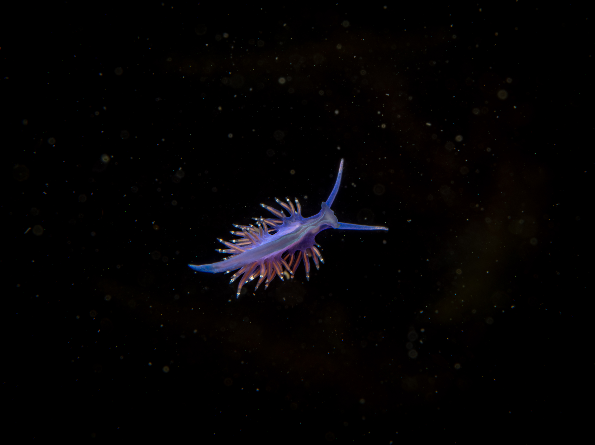

# My Photo Competition Entries - May 2026

This document contains the finalized submission details, photography metadata, and optimized descriptions for the upcoming photography competitions.

---

## Entry 1: "Marine Drama at Lough Hyne"

* **Target Competition:** "My Favourite Waterbody" Photo Competition 2026 (LAWPRO)
* **Submission Deadline:** 5:00 PM, Friday 22nd May 2026
* **Location:** Lough Hyne, County Cork (Europe's first Marine Nature Reserve)
* **Subject:** Ribbon worm (*Lineus longissimus*) preying upon a fan worm.
* **File Link:** [P4045593-3.jpg](./P4045593-3.jpg)
* **Requirements:** JPEG, PNG, or TIF (Max 15 MB)

### Image Preview

### Submission Caption
Lough Hyne, Europe’s first Marine Nature Reserve, is a uniquely spectacular sanctuary for marine biodiversity. Every dive offers a window into a complex, hidden world. This photograph captures a rare, fascinating ecological interaction beneath the surface: a predatory ribbon worm (*Lineus longissimus*) preying upon a fan worm and skillfully extracting it from its protective tube. It is a striking reminder of how vibrant and worthy of protection our marine ecosystems truly are.
*(439 characters / 500 max)*

---

## Entry 2: "The Mid-Water Drifter of Bantry Bay"

* **Target Competition:** "My Favourite Waterbody" Photo Competition 2026 (Alternative/Second Entry) **OR** Biodiversity Photographer of the Year 2026 (Deadline 31st May)
* **Location:** Bantry Bay, County Cork
* **Subject:** Lined nudibranch (*Coryphella lineata*) drifting in the water column.
* **File Link:** [P4257000-2.jpg](./P4257000-2.jpg)
* **Requirements:** JPEG, PNG, or TIF (Max 15 MB)

### Image Preview

### Submission Caption
Bantry Bay, County Cork, is a spectacular haven for shore diving—a brilliant, versatile way to explore Ireland's waters without the complexity of boats. This photograph captures a rare, magical moment right off the shore: a lined nudibranch (*Coryphella lineata*) drifting freely in mid-water. Normally found on the seabed, seeing this vibrant sea slug suspended against the dark open water feels like discovering a tiny alien, proving how world-class our shore-accessible marine life is.
*(482 characters / 500 max)*

---

## Quick Submission Checklist

- [ ] **File Size Check:** Verify both image file sizes are under 15 MB.
- [ ] **Address Details:** Confirm Eircode (`P72 WN29`) is ready for the LAWPRO submission portal.
- [ ] **Deadline Check:** Ensure submissions are uploaded to the [LAWPRO Portal](https://consult.watersandcommunities.ie/en/content/my-favourite-waterbody-photo-competition-2026) before **5:00 PM on Friday, May 22, 2026**.
